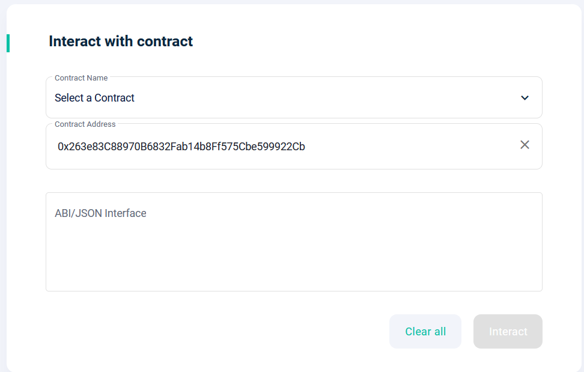

# New Management
### Category : Misc
### Difficulty : Easy

## Solution

So the challenge provides us two things, a netcat command, and a solidity file.

I knew very little about solidity other than the fact that is was used to create smart contracts for Ethereum, but that was enough to get started. 

There's a handy online IDE for solidity files called [Remix](https://remix.ethereum.org) that I used for this challenge.

Taking a brief look at the functions in the file, there's a getFlag function!

It seems to require that the user that calls the function has a balance greater than 1000. So the next thing we need to figure out is how to increase our balance. 

looking around, the next things to focus on are these functions

or more specifically, just the increaseBalance function
It takes in an address, and an amount, and increases the address's balance by the amount. Simple enough.

This one however, requires that the person calling the function is the 'owner'. 

Luckily, there's a handy little transferOwnership function :D

and this one has no "safeguards" :)

So, after a quick look at the solidity file, we've got to do the following
1. register
2. transfer ownership to ourselves
3. increase our balance > 1000
4. call getflag

Now, something I glossed over is how getFlag takes in a token as a parameter. But that's easily solved once you attempt the netcat command.

There's our token.

Soooo how do we actually 'call' these functions?

I originally attempted to all the steps through remix IDE, but it seems that remix doesn't actually interact with anything, or at least, I couldn't get it to. 

Instead, I decided to go the 'legit way' and created a [MetaMask](https://metamask.io/) wallet. 
Then, I used this website called [MyEtherWallet](https://www.myetherwallet.com/wallet/dashboard) to interact with the smart contract. 

We got the address from the netcat command, but what about this "ABI" thing? Well going back to Remix IDE, when you compile the provided solidity file you get these two handy buttons highlighted in green.

A quick copy paste and click on the interact button, and voila!

So we run through the steps, inserting our own wallet address as required, increasing our balance, and finally getting the flag with the token. Then we return to the netcat command in our console, say we're ready to get our flag by entering 'Y', and receive our flag. 

~~unfortunately it seems that the server has been taken offline so I can't get images for the final section as I forgot to record them at the time:(~~