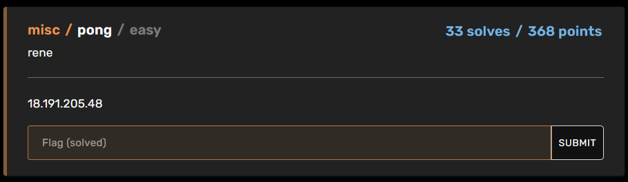
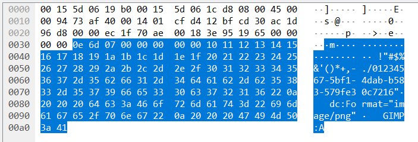
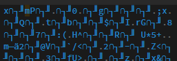
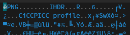
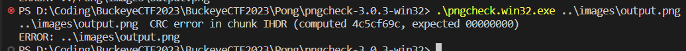

# Pong
### Category : Misc
### Difficulty : Easy

## Solution

The challenge is pretty barebones in the information it gives us, only an IP address, and the challenge title - Pong



My first thought on seeing this was that it had something to do with pinging the IP, I mean just looking at the name it makes sense doesn't it?

A normal ping packet is 64 bytes, but I noticed that I was receiving nearly twice the amount from the address, so the next step was to record all the responses through a tool like wireshark. 

Scrolling through the packet data, I eventually found this - 



Ah, it's a png broken up between the ping responses!

So, I let the packet capture run until I stopped receiving extra data, saved that as a pcapng file, and wrote a quick python script using the python-pcapng library that assembled a full file from the packet data. 

```python
import pcapng

allData = b""

with open('./ThePings.pcapng', 'rb') as fp:
    scanner = pcapng.FileScanner(fp)
    
    count = 0
    for block in scanner:	
        if type(block) == pcapng.blocks.EnhancedPacket:
            # print("-"*40)
            # print(block, type(block))

            data = block.packet_data

            if len(data) != 98:
                arr = data.split(b"01234567")

                # print("-"*40)
                # print(data, len(data))
                allData += arr[1]

                print(len(allData))

                # count += 1
                # if count > 1:
                #     break

with open("test", "wb") as f:
    f.write(allData)
```

So the next thing to do is just to rename the file with the png type and see what it shows right? Well, not quite.


Looking at the image file in a [hex editor](https://hexed.it/), turns out we're missing all of the essential headers that png files require.


Our png :



Example png : 



Next stop: [the best source i found for how pngs work](http://www.libpng.org/pub/png/spec/1.2/PNG-Structure.html)

After a bunch of reading up, turns out we need to insert the png file signature, the IHDR image header, and the IHDR header's CRC (Cyclic Redundancy Check). 
The file signature is easy enough, the file just needs to start with these 8 bytes `137 80 78 71 13 10 26 10`

The IHDR header however, is slightly more complicated. See, it specifies pretty much everything about how this particular image is formatted, aka the following :
- Width
- Height
- Bit depth
- Color type
- Compression method
- Filter method
- Interlace method


After discussing with my teammates, we decided to do some guessing based off what we thought would be provided. 

we chose the following values because they felt reasonable, pure guesswork.

- 8 bit depth
- Color type 6 (rgb and alpha)
- Compression method 0 (the only one in use)
- Filter method 0 (the only one in use)
- Interlace method 0 (no interlacing)

That leaves width, height, and the CRC to deal with. 
Well, after a quick google search, turns out there's a tool called pngcheck that can check for errors in your png files, *including* faulty CRC values. 

A quick download and a check of our png with generic 128x128 dimensions gave this response from pngcheck



And now we have a way to find the correct CRC value to insert at the end.

From here it was just us trying a couple different dimensions, recalculating CRC to match until we got the correct combination of all properties.

.png)

.png)

.png)

and there's our flag.

All in all, it was pretty cool to be manually reconstructing an image, and I definitely know way too much about png headers now.


### bonus

So, after the CTF ended and everyone got to talking, I learnt that apparently you can just ping the address with a packet that has sequence 0 in it's icmp header and you'd get a reponse back with the correct headers?

kinda makes everything I did a little uh, over complicated. 

in my defense I didn't know much about how any of the tools/protocols worked before i began so uh

¯\\\_(ツ)_/¯